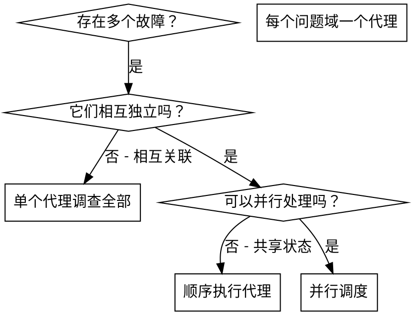

# 调度并行代理

## 概述

当你遇到多个不相关的故障（不同的测试文件、不同的子系统、不同的 bug）时，按顺序逐一调查会浪费时间。每个调查都是独立的，可以并行进行。

**核心原则：** 为每个独立的问题域分派一个代理，让它们并发工作。

## 何时使用



**适用场景：**
- 3 个或更多测试文件因不同根因失败
- 多个子系统独立出现故障
- 每个问题可以独立理解，无需其他上下文
- 调查之间没有共享状态

**不适用场景：**
- 故障相互关联（修复一个可能修复其他）
- 需要理解完整的系统状态
- 代理之间会相互干扰

## 执行模式

### 1. 识别独立域

按故障类型分组：
- 文件 A 测试：工具审批流程
- 文件 B 测试：批量完成行为
- 文件 C 测试：中止功能

每个域都是独立的 - 修复工具审批不会影响中止测试。

### 2. 创建聚焦的代理任务

每个代理需要：
- **明确范围：** 一个测试文件或子系统
- **清晰目标：** 使这些测试通过
- **约束条件：** 不要修改其他代码
- **预期输出：** 总结发现和修复内容

### 3. 并行调度

```typescript
// 在 Claude Code / AI 环境中
Task("修复 agent-tool-abort.test.ts 的失败用例")
Task("修复 batch-completion-behavior.test.ts 的失败用例")
Task("修复 tool-approval-race-conditions.test.ts 的失败用例")
// 三个任务并发运行
```

### 4. 审查与整合

当代理返回时：
- 阅读每个摘要
- 验证修复不冲突
- 运行完整测试套件
- 整合所有更改

## 代理提示结构

好的代理提示应该是：
1. **聚焦的** - 一个明确的问题域
2. **自包含的** - 包含理解问题所需的所有上下文
3. **输出明确的** - 代理应该返回什么？

```markdown
修复 src/agents/agent-tool-abort.test.ts 中的 3 个失败测试：

1. "should abort tool with partial output capture" - 期望消息中包含 'interrupted at'
2. "should handle mixed completed and aborted tools" - 快速工具被中止而非完成
3. "should properly track pendingToolCount" - 期望 3 个结果但得到 0

这些是时序/竞态条件问题。你的任务：

1. 阅读测试文件并理解每个测试验证的内容
2. 识别根因 - 是时序问题还是实际 bug？
3. 修复方式：
   - 用基于事件的等待替换任意超时
   - 如果发现 bug，修复中止实现
   - 如果测试行为已更改，调整测试期望

不要只是增加超时 - 找到真正的问题。

返回：总结你发现的内容和修复的内容。
```

## 常见错误

**❌ 范围过大：** "修复所有测试" - 代理会迷失方向
**✅ 具体明确：** "修复 agent-tool-abort.test.ts" - 聚焦的范围

**❌ 缺少上下文：** "修复竞态条件" - 代理不知道在哪里
**✅ 提供上下文：** 粘贴错误信息和测试名称

**❌ 没有约束：** 代理可能重构所有代码
**✅ 有约束：** "不要修改生产代码"或"仅修复测试"

**❌ 输出模糊：** "修复它" - 你不知道改了什么
**✅ 输出明确：** "返回根因和更改内容的摘要"

## 何时不使用

**关联故障：** 修复一个可能修复其他 - 先一起调查
**需要完整上下文：** 理解问题需要看到整个系统
**探索性调试：** 你还不知道什么坏了
**共享状态：** 代理会相互干扰（编辑相同文件、使用相同资源）

## 真实案例

**场景：** 重大重构后，3 个文件中有 6 个测试失败

**失败情况：**
- agent-tool-abort.test.ts：3 个失败（时序问题）
- batch-completion-behavior.test.ts：2 个失败（工具未执行）
- tool-approval-race-conditions.test.ts：1 个失败（执行次数 = 0）

**决策：** 独立域 - 中止逻辑、批量完成、竞态条件各自独立

**调度：**
```
代理 1 → 修复 agent-tool-abort.test.ts
代理 2 → 修复 batch-completion-behavior.test.ts
代理 3 → 修复 tool-approval-race-conditions.test.ts
```

**结果：**
- 代理 1：用基于事件的等待替换超时
- 代理 2：修复事件结构 bug（threadId 位置错误）
- 代理 3：添加等待异步工具执行完成

**整合：** 所有修复相互独立，无冲突，完整套件通过

**节省时间：** 3 个问题并行解决 vs 顺序解决

## 主要优势

1. **并行化** - 多个调查同时进行
2. **聚焦** - 每个代理范围窄，需跟踪的上下文少
3. **独立性** - 代理之间不相互干扰
4. **速度** - 在解决 1 个问题的时间内解决 3 个问题

## 验证

代理返回后：
1. **审查每个摘要** - 理解发生了什么更改
2. **检查冲突** - 代理是否编辑了相同的代码？
3. **运行完整套件** - 验证所有修复协同工作
4. **抽查检验** - 代理可能会犯系统性错误

## 实际影响

来自调试会话（2025-10-03）：
- 3 个文件中有 6 个失败
- 并行调度了 3 个代理
- 所有调查并发完成
- 所有修复成功整合
- 代理更改之间零冲突
