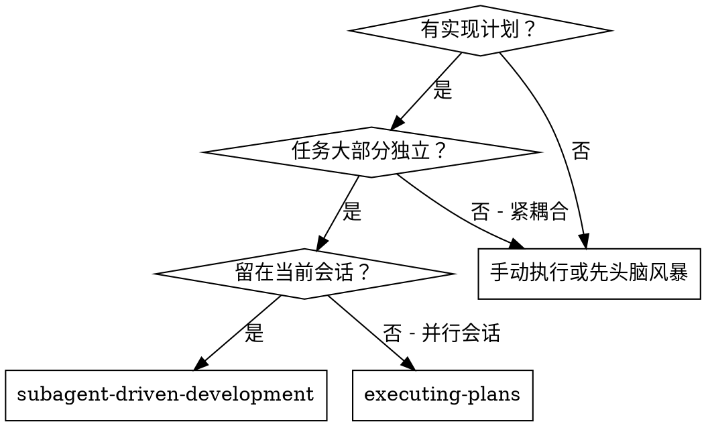
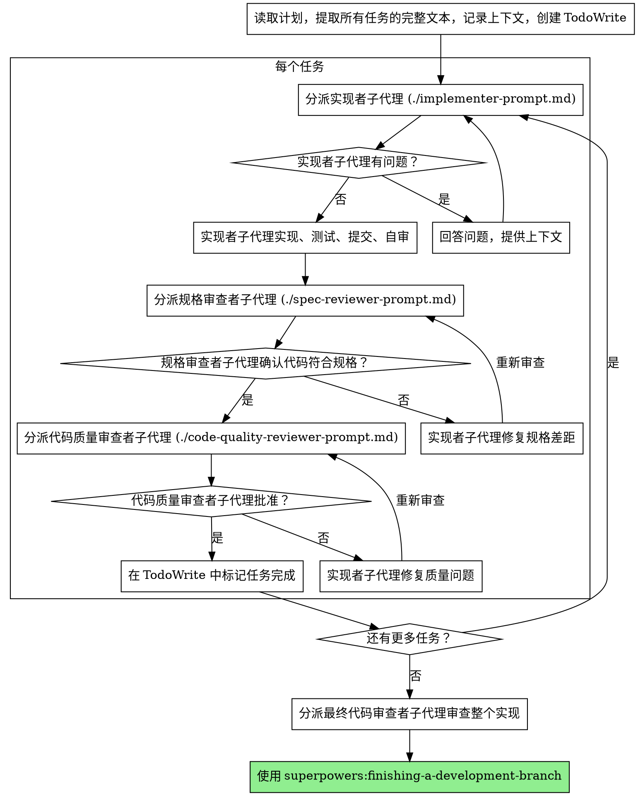

# 子代理驱动开发

通过为每个任务分派新的子代理来执行计划，每个任务完成后进行两阶段审查：先规格符合性审查，再代码质量审查。

**核心原则：** 每个任务使用新子代理 + 两阶段审查（规格 → 质量）= 高质量、快速迭代

## 何时使用



**与 Executing Plans（并行会话）的对比：**
- 同一会话（无上下文切换）
- 每个任务使用新子代理（无上下文污染）
- 每个任务后进行两阶段审查：先规格符合性，再代码质量
- 更快的迭代（任务之间无需人工介入）

## 流程



## 提示模板

- `./implementer-prompt.md` - 分派实现者子代理
- `./spec-reviewer-prompt.md` - 分派规格符合性审查者子代理
- `./code-quality-reviewer-prompt.md` - 分派代码质量审查者子代理

## 示例工作流

```
你: 我正在使用子代理驱动开发来执行这个计划。

[读取计划文件一次: docs/plans/feature-plan.md]
[提取所有 5 个任务的完整文本和上下文]
[创建包含所有任务的 TodoWrite]

任务 1: 钩子安装脚本

[获取任务 1 的文本和上下文（已提取）]
[分派实现子代理，提供完整任务文本 + 上下文]

实现者: "开始之前想确认一下 - 钩子应该安装在用户级别还是系统级别？"

你: "用户级别 (~/.config/superpowers/hooks/)"

实现者: "明白了。正在实现..."
[稍后] 实现者:
  - 实现了 install-hook 命令
  - 添加了测试，5/5 通过
  - 自审：发现我漏掉了 --force 标志，已添加
  - 已提交

[分派规格符合性审查者]
规格审查者: ✅ 符合规格 - 满足所有需求，没有多余内容

[获取 git SHA，分派代码质量审查者]
代码审查者: 优点：测试覆盖良好，代码整洁。问题：无。已批准。

[标记任务 1 完成]

任务 2: 恢复模式

[获取任务 2 的文本和上下文（已提取）]
[分派实现子代理，提供完整任务文本 + 上下文]

实现者: [没有问题，直接开始]
实现者:
  - 添加了 verify/repair 模式
  - 8/8 测试通过
  - 自审：一切正常
  - 已提交

[分派规格符合性审查者]
规格审查者: ❌ 问题：
  - 缺少：进度报告（规格要求"每 100 项报告一次"）
  - 多余：添加了 --json 标志（未要求）

[实现者修复问题]
实现者: 移除了 --json 标志，添加了进度报告

[规格审查者再次审查]
规格审查者: ✅ 现在符合规格

[分派代码质量审查者]
代码审查者: 优点：扎实。问题（重要）：魔法数字（100）

[实现者修复]
实现者: 提取了 PROGRESS_INTERVAL 常量

[代码审查者再次审查]
代码审查者: ✅ 已批准

[标记任务 2 完成]

...

[所有任务完成后]
[分派最终代码审查者]
最终审查者: 满足所有需求，可以合并

完成！
```

## 优势

**与手动执行相比：**
- 子代理自然遵循 TDD
- 每个任务有新鲜上下文（不会混乱）
- 并行安全（子代理不会相互干扰）
- 子代理可以提问（工作前和工作中都可以）

**与 Executing Plans 相比：**
- 同一会话（无交接）
- 持续进展（无需等待）
- 审查检查点自动进行

**效率提升：**
- 无文件读取开销（控制器提供完整文本）
- 控制器精确策划所需上下文
- 子代理预先获得完整信息
- 问题在工作开始前浮现（而非之后）

**质量门控：**
- 自审在交接前发现问题
- 两阶段审查：规格符合性，然后代码质量
- 审查循环确保修复确实有效
- 规格符合性防止过度/不足构建
- 代码质量确保实现构建良好

**成本：**
- 更多子代理调用（每个任务需要实现者 + 2 个审查者）
- 控制器做更多准备工作（预先提取所有任务）
- 审查循环增加迭代次数
- 但能早期发现问题（比后期调试更便宜）

## 危险信号

**绝对不要：**
- 跳过审查（规格符合性或代码质量）
- 带着未修复的问题继续
- 并行分派多个实现子代理（会冲突）
- 让子代理读取计划文件（直接提供完整文本）
- 跳过场景设定上下文（子代理需要了解任务定位）
- 忽略子代理的问题（在让他们继续之前回答）
- 接受规格符合性的"差不多"（规格审查者发现问题 = 未完成）
- 跳过审查循环（审查者发现问题 = 实现者修复 = 再次审查）
- 让实现者自审取代实际审查（两者都需要）
- **在规格符合性通过之前开始代码质量审查**（顺序错误）
- 在任一审查有未解决问题时进入下一个任务

**如果子代理提问：**
- 清楚、完整地回答
- 如需要，提供额外上下文
- 不要催促他们进入实现

**如果审查者发现问题：**
- 实现者（同一子代理）修复它们
- 审查者再次审查
- 重复直到批准
- 不要跳过重新审查

**如果子代理任务失败：**
- 分派修复子代理，给出具体指示
- 不要尝试手动修复（上下文污染）

## 集成

**必需的工作流技能：**
- **superpowers:writing-plans** - 创建本技能执行的计划
- **superpowers:requesting-code-review** - 审查者子代理的代码审查模板
- **superpowers:finishing-a-development-branch** - 所有任务完成后完成开发

**子代理应使用：**
- **superpowers:test-driven-development** - 子代理对每个任务遵循 TDD

**替代工作流：**
- **superpowers:executing-plans** - 用于并行会话而非同会话执行
